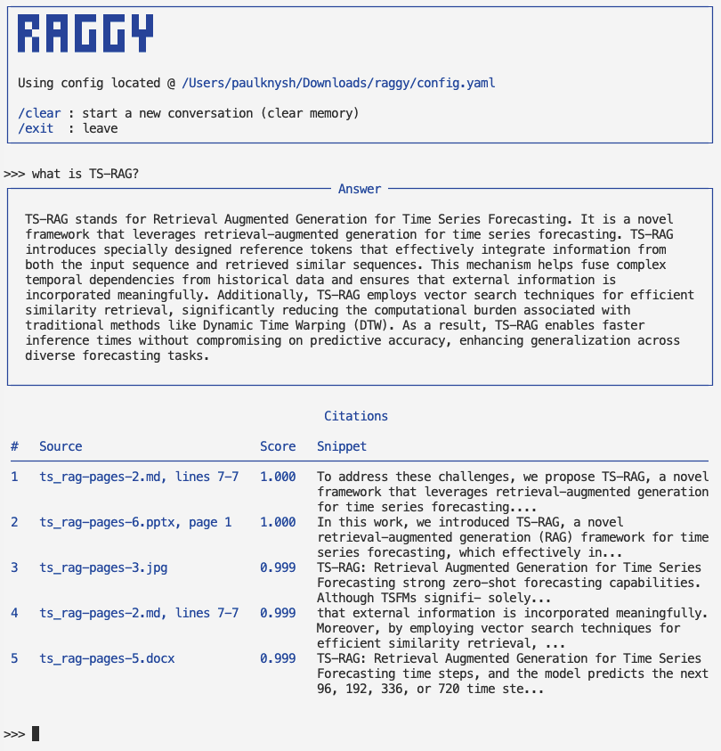

# raggy

A lightweight Retrieval-Augmented Generation (RAG) package built with
LangChain and Chroma. It is local-first: your documents and the vector DB live
entirely on your machine, embeddings run locally via Ollama, and answer
generation can run locally (Ollama) or via a cloud provider's API. It supports
common formats (PDF, Word, PowerPoint, plain text, images) and uses OCR
automatically when needed.

Supported file formats — all other files are ignored:

`.pdf`, `.docx`, `.pptx`, `.txt`, `.md`, `.markdown`, `.html`, `.htm`, `.png`, `.jpg`, `.jpeg`, `.bmp`.


## Set up

Ollama is required for running local embedding model (which feeds the on-disk DB):

```bash
curl -fsSL https://ollama.com/install.sh | sh
ollama serve
ollama pull nomic-embed-text   # default embedding model, always required
```

In case LLM will be used locally via Ollama:

```bash
ollama pull llama3.2           # default local LLM
```

In case API key will be used for accessing LLM remotely, standard environment variable needs to be set (which is one of):

```bash
export GEMINI_API_KEY=...       # llm_provider: google
export OPENAI_API_KEY=...       # llm_provider: openai
export ANTHROPIC_API_KEY=...    # llm_provider: anthropic
```

Then `config.yaml` needs to be updated with proper `llm_provider` ("openai", "anthropic", "google") and `llm_model` (e.g. "gemini-3.5-flash")


## Installing `raggy`

Requires Python 3.10 or newer.

### Install with uv (recommended)

`uv` creates and manages the virtual environment for you:

```bash
uv sync
```

### Install with pip

Requires an **active virtual environment**:

```bash
pip install -e .
```

### Testing, linting, and formatting

The following command runs ruff lint, formatting, and pytest:

```bash
make sure
```

## Usage

Type `raggy` command to run interactive CLI:



Or use it as a library:

```python
from raggy import run_pipeline, source_label

query = "What GPU hardware was used to run the TS-RAG experiments?"

response, retrieved_docs = run_pipeline(query)

print(f"\n*** RESPONSE:\n\n{response}\n\n***")

for i, doc in enumerate(retrieved_docs, 1):
    print(f"\n\n=== Doc {i} [{source_label(doc)}] ===\n\n")
    print(doc.page_content)
```

## Configuration

All runtime settings are read from `config.yaml` (the file must be present in the
working directory when you run the `raggy` CLI or import the library):

| Setting | Description |
| --- | --- |
| `sources` | **list of source directories and/or files** |
| `persist_directory` | location where the DB itself is stored |
| `embedding_model` | Ollama embedding model (e.g. `nomic-embed-text`) |
| `chunk_size` | chunk size in characters |
| `chunk_overlap` | character overlap between adjacent chunks |
| `batch_size` | max number of chunks embedded per batch into Chroma (default `100`); the number of batches is derived dynamically from the chunk count |
| `llm_provider` | where generation runs: `ollama` (local, default) or `openai`/`anthropic`/`google` (via API) |
| `llm_model` | chat model for generation (e.g. `llama3.2` locally, or a remote model name like `gpt-4o`) |
| `temperature` | LLM sampling temperature |
| `search_type` | retriever search type (e.g. `mmr` or `similarity`) |
| `retrieve_k` | number of chunks returned by the first-stage retrieval |
| `mmr_fetch_k` | number of candidate chunks fetched before MMR reranking (used when `search_type: mmr`) |
| `rerank_enabled` | whether to use additional reranking after retrieval stage (off by default) |
| `rerank_model` | Hugging Face ID of the cross-encoder model (default `cross-encoder/ms-marco-MiniLM-L6-v2`) |
| `rerank_k` | final number of chunks returned by the cross-encoder (must be `<= retrieve_k`) |
| `system_prompt` | system prompt dictating how the LLM should answer; must contain a `{context}` placeholder |

## Demo dataset

This article (https://arxiv.org/abs/2608.06223v1) is used here for testing. It's an 8-page document -- each page
is saved in different file formats (including PDF, plaintext, images, MS Word) and saved inside
`sample_docs` directory. These directories are specified in `config.yaml` by default.

## Demo eval

`eval` folder currently contains simple Q&A dataset to test pipeline performance on demo dataset end-to-end.
To run the test, start the Ollama service with the embedding model pulled (embeddings are always local), then run:

```bash
uv run eval/run_eval.py
```

It computes basic retrieval/generation metrics and produces a summary (both printed and saved to `eval/results.json`).


## The DB management

The Chroma DB lives in the directory configured by `persist_directory`
(default `./chroma_db`). It is (re-)indexed automatically on each run as needed.

### How the DB is created

On the first run, `initialize_db` (in `raggy/vectorstore.py`) loads every
supported file under each entry in `sources`, splits them into overlapping chunks,
and embeds them into Chroma. It also writes a `manifest.yaml` into the persist
directory recording these parameters:
- `sources`
- `chunk_size`
- `chunk_overlap`
- `embedding_model`
- `content_hash` — a SHA-256 fingerprint of the source files

### How/when the DB is re-indexed

The `manifest.yaml` is cheap to recompute, so for every new run it is computed and compared against existing one.
Any changes to its content, including changes to `content_hash` will cause DB to be re-indexed.


## Notes

- `PyPDFLoader` parses PDFs page-by-page (each Document carries a `page` key);
  PowerPoint decks are parsed slide-by-slide (also exposed as `page`); text-based
  files (`txt`/`md`/`markdown`/`html`) get approximate `start_line`/`end_line`
  annotations via `annotate_line_numbers`. Word documents (`.docx`) and images
  carry no location metadata — DOCX has no native page boundaries (Word's
  pagination can't be reproduced reliably) and images have no meaningful lines.
- Image files (`.png`/`.jpg`/`.jpeg`/`.bmp`) are OCR'd with RapidOCR (runs fully
  on-device via ONNX Runtime); PDFs with no extractable text layer are detected
  and automatically OCR'd page-by-page as well.
- The `langchain-community` loader deprecation warning is suppressed in the
  pytest config.

## TODOs

- [x] Support of popular LLM providers via API keys
- [x] Conversation memory in chat mode
- [x] Pydantic validation of config file
- [ ] Hybrid retrieval, tuning config defaults
- [ ] UX/UI tuning of CLI (improved commands/statuses etc)
- [ ] Performance optimizations

## License

MIT
